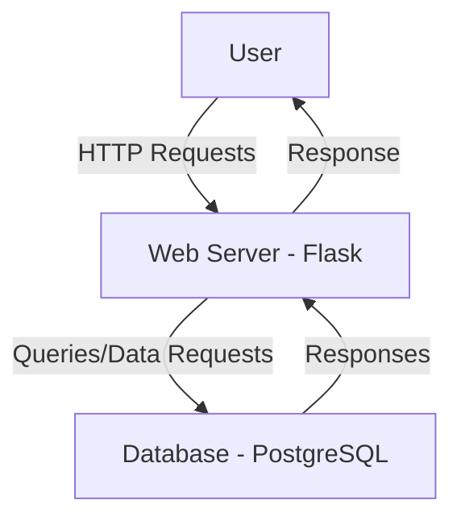
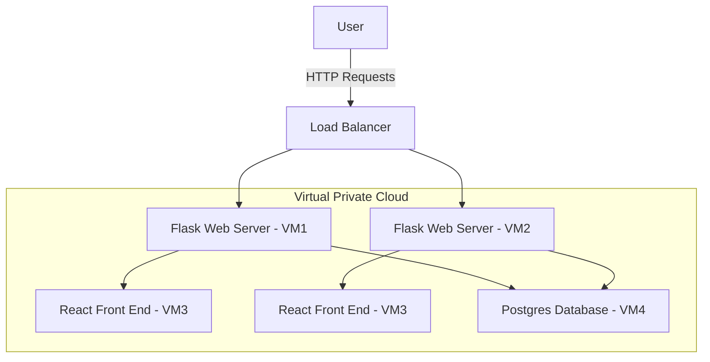
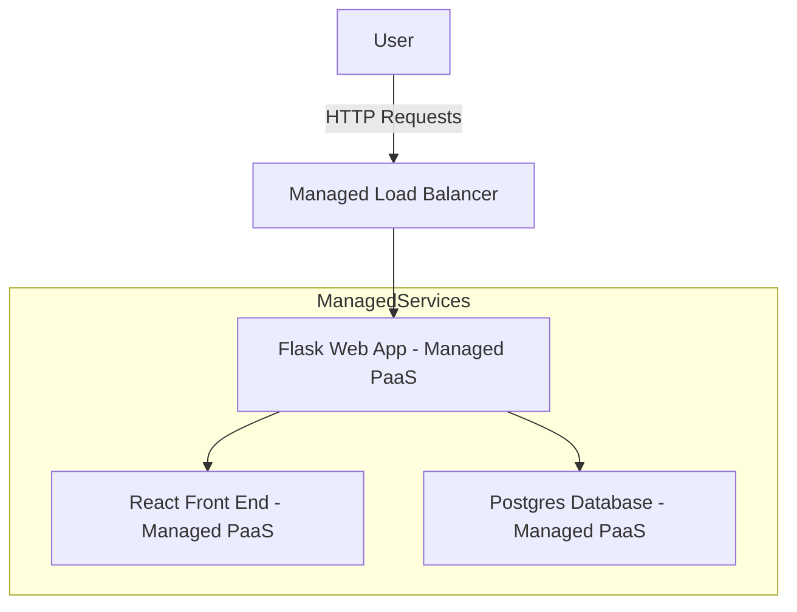

# 0. Original

The on-premise prototype does not have any load balancing and takes more computing power to response. We can use IAAS and PAAS to improve this application.

# 1. IAAS as infrastructure

Components:
- User: The user sends HTTP requests and manage the system.

- Load Balancer: This split traffic between two Flask web servers for reliability, scalability and availability. In case one server fails, the other can handle incoming requests.

- Flask Web Server (VM1, VM2): The Flask application is deployed on virtual machines (VMs). These VMs are in the cloud and are created for load balancing and are handling the backend services and API calls. I have 2 VMs just in case one fails.

- React Front End (VM3): The front-end React application is also deployed on a VM. This is the UI, allowing users to interact with the backend. A VM offers flexibility but needs more management. 

- Postgres Database (VM4): The PostgreSQL database is hosted on a separate VM. It handles all the data storage, including user data, logs, session data, etc.

- VPC (Virtual Private Cloud): All components are hosted in a Virtual Private Cloud, providing an isolated network for the application, ensuring secure communication between the various layers (web, front end, and database).

# 2. PAAS as an infrastructure

Components:
- User: The end-user interacts with the system by sending HTTP requests, same as in IaaS.

- Managed Load Balancer: A load balancer provided as part of the PaaS platform. This is a service that helps with distributing traffics automatically. 

- Flask Web App (Managed PaaS): In PaaS, the Flask web application is deployed to a fully managed service (e.g., AWS Elastic Beanstalk, Azure App Service, or Google App Engine). Thanks to these platforms, the user does not need to manage individual VMs. The cloud provider can also handle scaling, load balancing, and updating. 

- React Front End (Managed PaaS): The React front-end is hosted on a managed service (e.g., AWS S3 for static hosting, or another PaaS provider). We also do not need to configure and manage individual VM. The cloud platform can take care of its delivery and availability. 

- Postgres Database (Managed PaaS): The PostgreSQL database is hosted on a managed database service (e.g., AWS RDS, Azure Database for PostgreSQL, or Google Cloud SQL). It handles backups, scaling, patching, and replication, removing the need for manual database maintenance.

- Managed Services: All components (web app, front end, and database) are hosted in a managed environment, which gets rid of the need for infrastructure. 