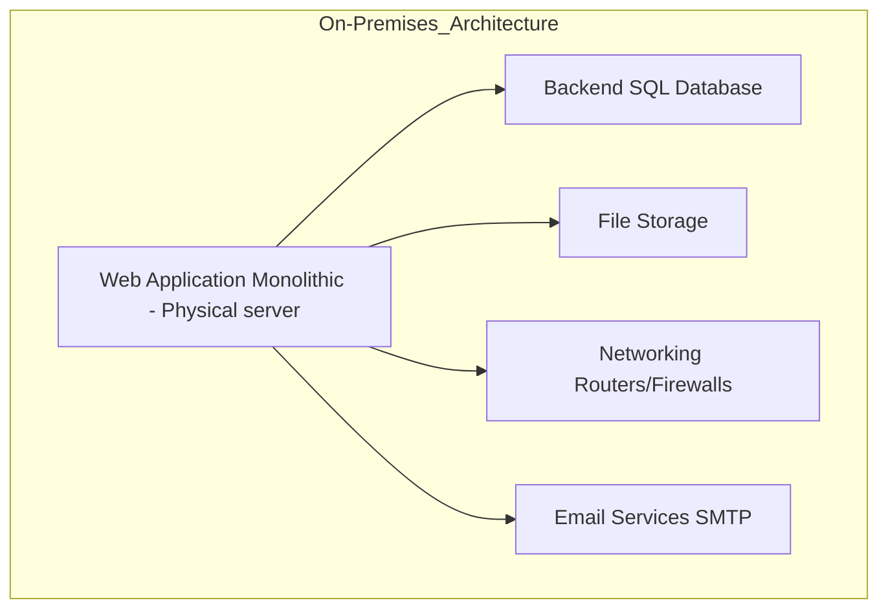

## On-Premises Architecture

### 1. On-premise components:

- **Web Application (Monolithic)**: Hosted on physical servers, responsible for handling user requests and transactions.
- **Backend SQL Database**: Stores all customer, product, and transaction data, assumingly in Microsoft Access.
- **File Storage**: Local storage system on premise that holds media files, logs, and reports.
- **Networking**: Managed using on-premises routers, switches, and firewalls.
- **Email Services**: SMTP-based service used for sending notifications to clients.

### 2. Key Components to Migrate: 

Each of these components must be mapped to appropriate cloud service models (IaaS, PaaS, or SaaS):

- **Web Application**: We can move the Web application to Azure VMs, or IaaS for more control.
- **Backend Database**: We can fit this database into Azure SQL Database, or PaaS
- **File Storage**: Move to PaaS storage, Azure Blob Storage.
- **Networking**: Use cloud-native networking tools (Azure Virtual Network).
- **Email Services**: Could migrate to a SaaS like SendGrid, Office 365.

The following diagram represents the on-premises architecture:

## Migration strategy

- **Web Application (Monolithic)**: Migrate from a physical server to a VM, (IaaS).
- **Backend SQL Database**: Migrate the storage onto the cloud using Azure SQL Database, (PaaS).
- **File Storage**: We will use Azure Blob Storage as a scalable solution (PaaS)
- **Networking**: Use cloud-native networking services to replace traditional routers and firewalls. Implement virtual networks, load balancers, and firewalls. (Cloud-native networking)
- **Email Services**: We should use a software to automate this process (SaaS)

## Migration Plan

**Component**| **Migration Target**| **Cloud Model**|**Strategy**|**Rationale**|
|----------------------------|------------------------------|----------------|----------------------------|----------------------------------------------------|
| Web Application (Monolithic) | Virtual Machine (Azure/AWS)  | IaaS           | Lift and Shift              | Retains control over app environment               |
| Backend SQL Database        | Azure SQL Database           | PaaS           | Refactor                    | Reduced management overhead for database            |
| File Storage                | Azure Blob Storage  |  PaaS    | Refactor  | Scalable storage for files and logs                 |
| Networking                  | Cloud-Native Networking      | Cloud-Native   | Rehost and customize                    | Flexible, customizable networking                   |
| Email Services              | Microsoft 365, SendGrid      | SaaS           | Refactor                    | Automated and scalable email service                |

## Detailed Migration Steps

### Step 1: Web Application (Monolithic) to IaaS (VM):

- Strategy: Perform a "Lift and Shift" migration by moving the web application as-is onto a Virtual Machine in the cloud.
- Benefits: Control over the application environment and flexibility in customization, while keeping minimal changes to the codebase.
### Step 2: Backend SQL Database to PaaS (Azure SQL Database):

- Strategy: Refactor the backend database to a managed PaaS offering, which reduces the management of infrastructure while providing automatic scaling and backups.
- Benefits: Improved performance, lower administrative effort, and cost-effectiveness.
### Step 3: File Storage to PaaS (Azure Blob Storage):

- Strategy: Refactor the file storage to a scalable and cost-effective Blob Storage service, which allows for large-scale storage.
- Benefits: Scalability, security, and easier management of files compared to managing storage on a VM.
### Step 4: Networking (Cloud-Native):

- Strategy: Rehost the networking infrastructure using Cloud-Native components such as Network Security Groups (NSGs), VPN, and Load Balancers.
- Benefits: Advanced networking capabilities and flexible customization, allowing for better network segmentation and security.
### Step 5: Email Services to SaaS (Microsoft 365, SendGrid):

- Strategy: Refactor email services to a SaaS provider like Microsoft 365 or SendGrid, automating and scaling email delivery.
- Benefits: Reduced complexity and maintenance with a scalable, reliable email solution.
