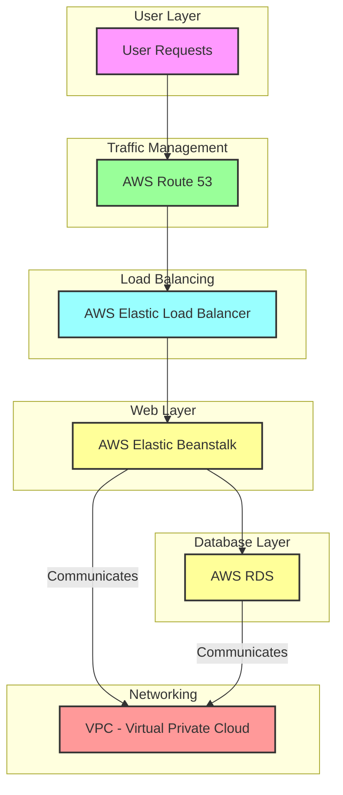

# Solution diagram for the target architecture
Below is my architecture diagram for refactoring this application that is running on 2 virtual machines: 

# A description of the target architecture

Traffic Management: AWS Route 53 serves as a DNS service that routes user requests to the appropriate resources.

Load Balancing: AWS Elastic Load Balancer distributes incoming application traffic across multiple EC2 instances to ensure high availability.

Web Layer: AWS Elastic Beanstalk provides a platform for deploying and managing the web application, handling scaling and monitoring automatically.

Database Layer: AWS RDS (Relational Database Service) manages the SQL database with built-in features for high availability, backup, and scaling.

Networking: VPC (Virtual Private Cloud) facilitates secure communication between all components within a defined network.

# Steps of migration

## 1. Assessment and Planning
- Application Review: Review the existing application architecture (WebServerVM and SQLVM), performance requirements, and interdependencies between components.
- AWS Services Mapping: Map the existing virtual machines (VMs) to AWS services:
- WebServerVM → AWS Elastic Beanstalk.
- SQLVM → Amazon RDS for a managed relational database.
## 2. Provisioning AWS Resources
- Set Up VPC: Create a Virtual Private Cloud (VPC) for network isolation, security, and control over resources.
- Launch Elastic Beanstalk: Create an AWS Elastic Beanstalk for the web application from the WebServer VM. Beanstalk is a better solution, allowing automatic scaling, load balancing, and easy deploying updates.
- Set Up Amazon RDS: Instead of the SQLVM, we will migrate the database to Amazon RDS, a managed database service that ensures highavailability and failover options.
## 3. Data Migration
- Database Migration:
Use AWS Database Migration Service (DMS) to replicate the existing SQL database (from SQLVM) to Amazon RDS.
Ensure consistency and integrity of the data by running pre- and post-migration checks.
- Migrate Application Files:
If there are static assets, migrate them to Amazon S3 (Simple Storage Service) for cost-efficient storage and integration with Elastic Beanstalk or EC2.
## 4. Refactor Application
- Modify Configuration: Now that we have moved our application to Elastic Beanstalk, we need to update strings, variables and dependencies correctly to link them with the new database (Amazon RDS, Amazon S3) and other Amazon services 
- Implement Auto-scaling and Load Balancing:
Ensure that the application is set up to scale horizontally using AWS Elastic Load Balancer. This will distribute incoming traffic evenly across multiple instances of the application. 
## 5. Testing
- Functional and Load Testing:
Conduct functional testing to ensure that the application behaves as expected in the AWS environment.
Perform load testing to verify the application's ability to handle traffic, leveraging AWS auto-scaling and Elastic Load Balancer.
- Failover Testing:
Test failover scenarios, ensuring high availability and confirming that Route 53 redirects traffic correctly during downtime. Amazon Route 53 is a highly available and scalable Domain Name System (DNS) web service. We can use this for domain registration, DNS routing, and health checking.
## 6. Cutover and Go Live
- Set Up AWS Route 53:
Configure AWS Route 53 to manage DNS routing. It will direct user traffic to the new AWS resources and ensure low-latency access.
- Schedule Migration Window:
Migrate the application during off-peak hours, aiming to minimize the downtime. Since the application can tolerate up to 6 hours of downtime, ensure the cutover process is carefully planned.
- Switch DNS:
Update the DNS settings to point to AWS Route 53 so that all incoming requests are directed to the new environment.
## 7. Monitoring and Optimization
- Set Up Monitoring:
Use AWS services to self-health checks and monitor the application performance, resource usage, and alerting on any critical issues.
- Optimize Resources:
Continuously monitor traffic and optimize resource usage by adjusting auto-scaling settings, storage options (e.g., S3 lifecycle policies), and database performance.
## 8. Delete Previous Infrastructure
- Validate Migration Success:
Once all components are successfully migrated and verified in the AWS environment, confirm the application's stability and performance.
- Delete VMs:
Get rid of the WebServerVM and SQLVM by terminating these VMs to avoid incurring additional costs once the new architecture is properly set up. 
