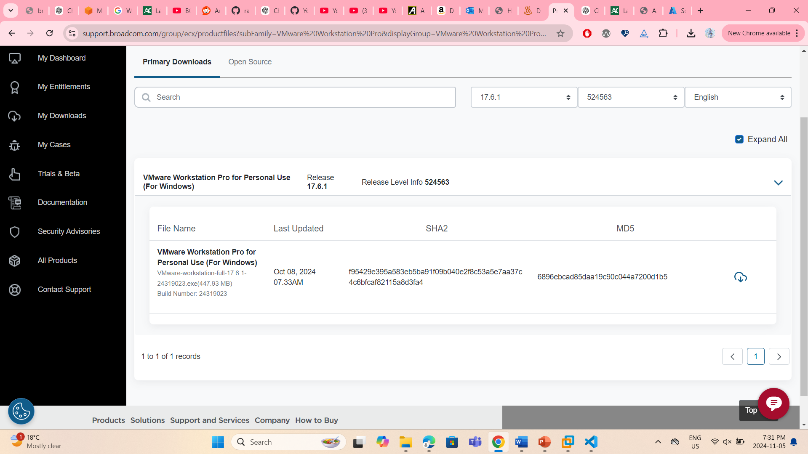
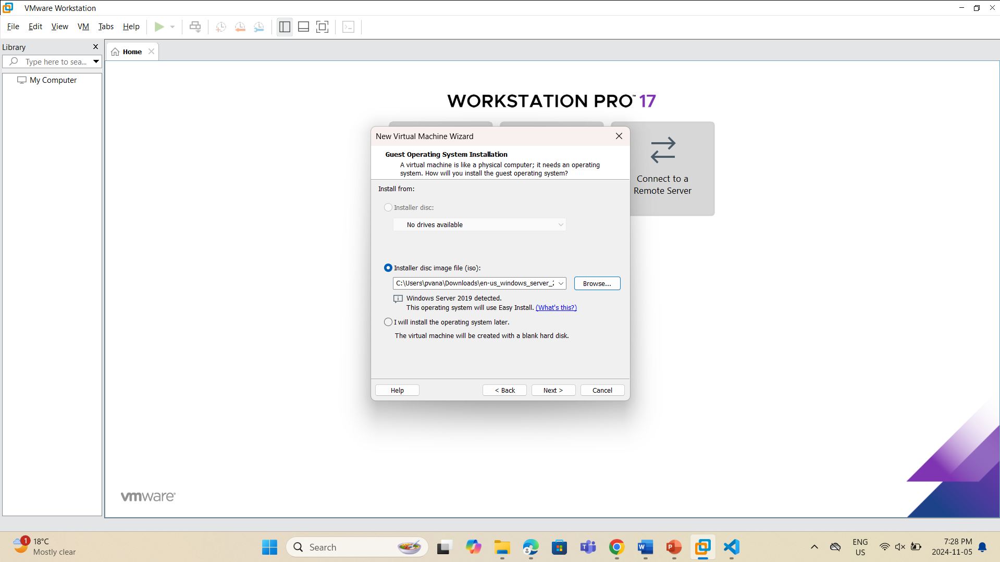
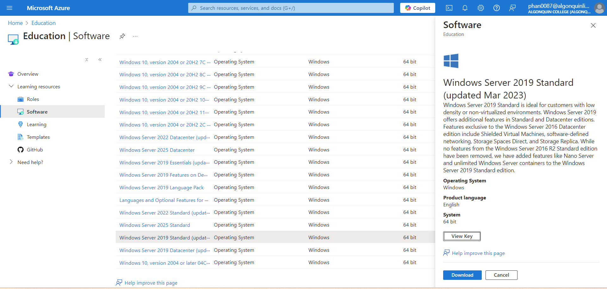
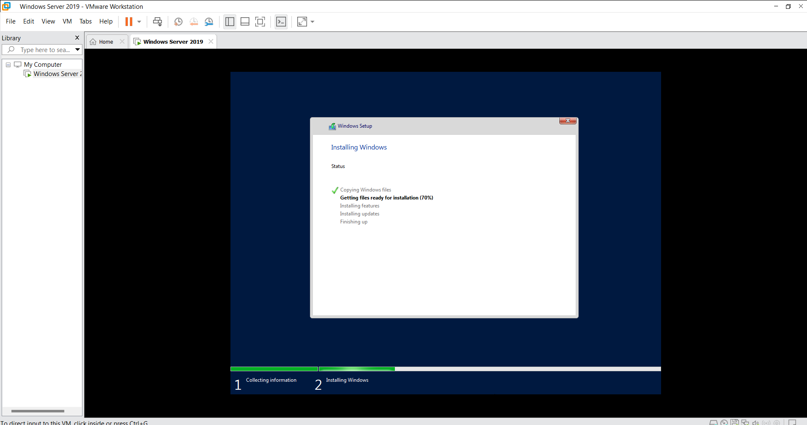
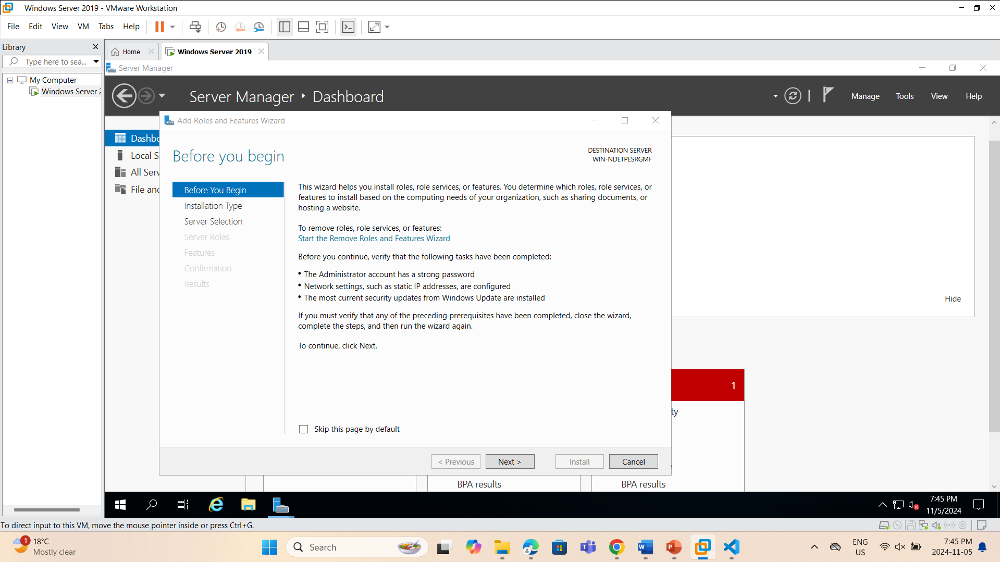
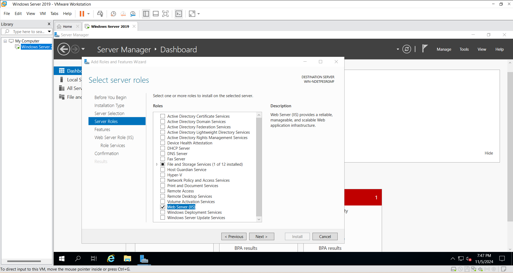
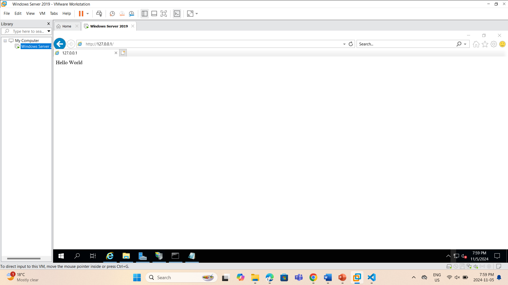
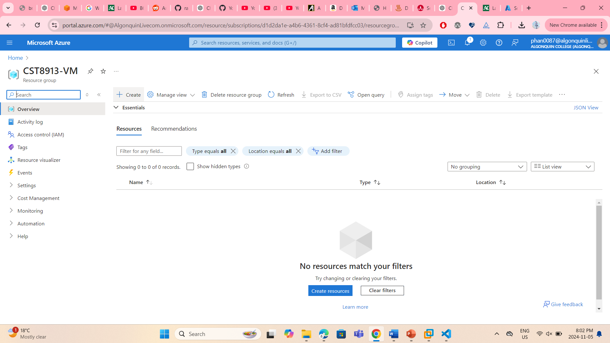

# Lab VM Migration
## Assessment Report
### Milestone 1: Environment setup
* First, I download VMwareWorkStation Pro 17.5. 

* After that, I create a VM and with the iso I downloaded from Azure Education

* Installing Windows

* Deploy a "Hello World" application

The source file is available on: http://127.0.0.1/

* Log onto Azure and create a resource group for the Migration

